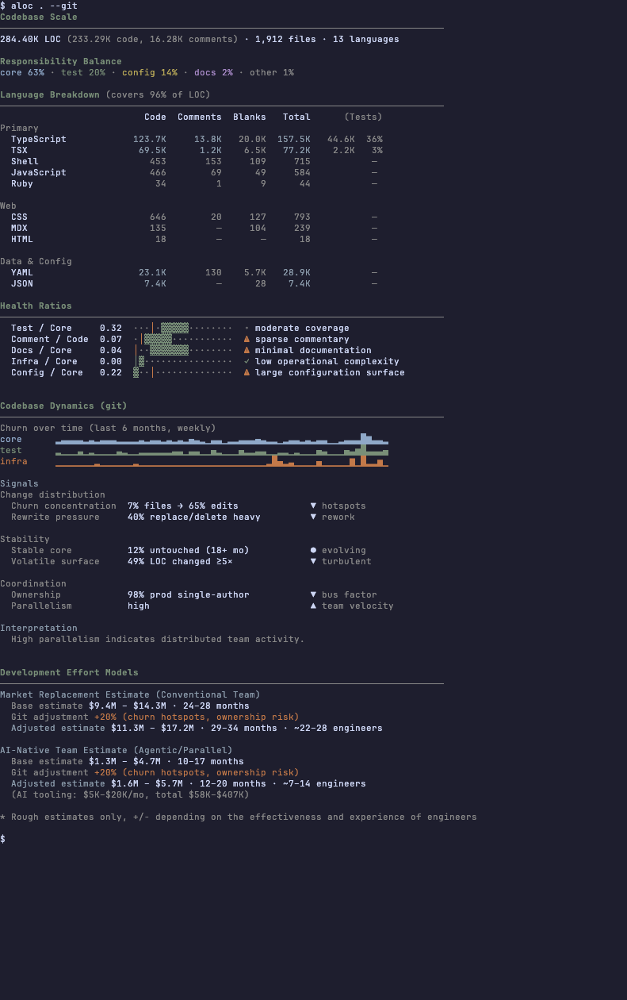

# aloc - Semantic LOC Codebase Analyzer

Semantic LOC counter that classifies code by role (core, test, docs, infra) with health ratios and effort estimates.



## Installation

```bash
go install github.com/modern-tooling/aloc/cmd/aloc@latest
```

Or build from source:

```bash
git clone https://github.com/modern-tooling/aloc.git
cd aloc
go build -o aloc ./cmd/aloc
```

## Usage

```bash
aloc .                        # Analyze current directory
aloc . --effort               # Include effort estimates
aloc . --format json --pretty # JSON output
aloc . --deep                 # Deep analysis (header probing)
```

## What It Shows

**Codebase Scale** - Total lines, files, and languages in a single line.

**Responsibility Balance** - How code is distributed across roles (core, test, docs, infra, config).

**Language Breakdown** - LOC by language, grouped by category (Primary, DevOps, Data, Documentation). Includes embedded code detection (e.g., code blocks in Markdown).

**Health Ratios** - Key metrics with visual gauges:
- Test / Core - test coverage relative to core code
- Comment / Code - explanation density
- Docs / Core - documentation coverage
- Infra / Core - operational complexity
- Config / Core - configuration surface area

**Development Effort Models** - Cost and timeline estimates using two models:
- *Market Replacement (Conventional Team)* - COCOMO-based estimate for traditional teams
- *AI-Native Team (Agentic/Parallel)* - Estimate for teams using AI-assisted parallel workflows

## Flags

| Flag | Description |
|------|-------------|
| `--format`, `-f` | Output format: `tui` (default), `json` |
| `--effort` | Include effort estimates |
| `--git` | Enable git history analysis (churn sparklines, stability metrics) |
| `--git-months` | Months of history for git analysis (default: 6) |
| `--deep` | Enable header probing and extensionless file analysis |
| `--files` | Include file-level details |
| `--pretty` | Pretty-print JSON output |
| `--ai-model` | AI model for cost estimation: `sonnet`, `opus`, `haiku` |
| `--human-cost` | Monthly cost per engineer (default: 15000) |
| `--config`, `-c` | Config file path |
| `--no-color` | Disable colors |
| `--no-embedded` | Hide embedded code blocks in Markdown |

AI-assisted commits are shown as timeline markers to contextualize periods of iteration and rework.

## Configuration

Create `aloc.yaml` in your project root:

```yaml
exclude:
  - "**/fixtures/**"
  - "**/testdata/**"

options:
  header_probe: false
  neighborhood: true

overrides:
  test:
    - "**/testing/**"
  generated:
    - "**/*.gen.go"
```

## Semantic Roles

| Role | Description |
|------|-------------|
| core | Core application code |
| test | Test files |
| infra | Infrastructure (Terraform, Docker, CI) |
| docs | Documentation |
| config | Configuration files |
| generated | Auto-generated code |
| vendor | Third-party code |
| scripts | Build scripts and tools |
| examples | Example code |
| deprecated | Deprecated code |

## Performance

Optimized for large monorepos:
- Skips cache directories (.pnpm-store, .terraform, node_modules, etc.)
- Quick mode (default) scans only known source extensions
- Deep mode analyzes extensionless files and probes headers

## Documentation

- [AI Cost Model](docs/ai-cost-model.md) - Token estimation methodology and pricing

## Effort Models

aloc estimates development effort using multiple delivery models, not a single number.

This reflects a simple reality: the cost of software depends as much on *how* teams work as on how much code exists.

### Market Replacement (Conventional Team)

This model answers: *"What would it cost to replace this codebase using a typical engineering organization?"*

**Assumptions:**
- Conventional team structure with mixed skill distribution
- Sequential work with coordination overhead
- Partial AI usage (autocomplete, chat assistance)

Output is presented as a range, reflecting uncertainty in productivity and rework:

```
Market Replacement Estimate (Conventional Team)
$12.9M – $17.0M · 30–36 months · ~30 engineers
```

This estimate is comparable to COCOMO-style models and is useful for executive planning, acquisition diligence, and large-scale budgeting.

### AI-Native Team (Agentic/Parallel)

This model reflects a different delivery approach:

- Work is decomposed into tasks and executed in parallel
- Multiple AI agents draft code, tests, and documentation
- Humans supervise, review, integrate, and make final decisions
- Coordination overhead is reduced, but not eliminated

**This model does not assume replacement of human judgment.** Instead, it reflects AI-assisted parallel execution under human oversight.

```
AI-Native Team Estimate (Agentic/Parallel)
~$6.5M – $9.5M · 12–18 months · ~10–15 engineers
(AI tooling: ~$2K–$10K per month)
```

This estimate is intentionally conservative and should be interpreted as:
- Feasible for teams that embrace agentic workflows
- Dependent on effective task decomposition
- Not a universal outcome

### A Note on Accuracy

These estimates are best-effort approximations for rough relative comparison. The field would benefit from more rigorous research on development effort analysis—both for conventional teams and AI-native workflows. If you're aware of relevant studies or have data to share, contributions are welcome.

## License

MIT
